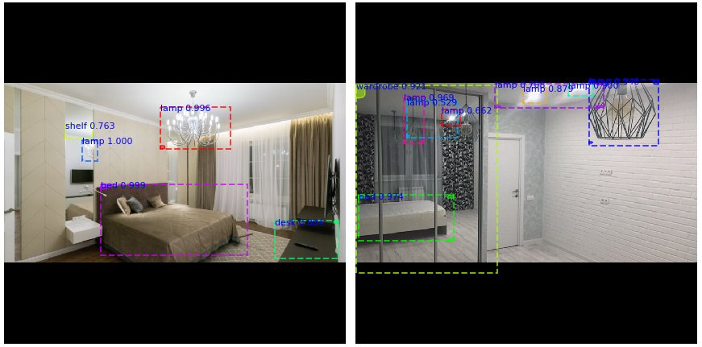

# WhateverHack Task 2 

Code for the 1st place solution in task 2 [whateverhack](https://whateverhack.ai/).  
Task [description](http://go.datasouls.com/c/whatever2/description) and [leaderboard](http://go.datasouls.com/c/whatever2/leaderboard).

We used Mask R-CNN to detect furniture in photos of real estate. To achieve best results we use an ensemble prediction of several different model checkpoints. Base model implementation [matterport/Mask_RCNN](https://github.com/matterport/Mask_RCNN).

Our team:
- Renat Bashirov ([linkedin](https://www.linkedin.com/in/renat-bashirov-8811bb116/), [kaggle](https://www.kaggle.com/rmbashirov), [github](https://github.com/rmbashirov))
- Ruslan Baikulov ([linkedin](https://www.linkedin.com/in/ruslan-baikulov/), [kaggle](https://www.kaggle.com/romul0212), [github](https://github.com/lRomul))
- Ali Aliev ([linkedin](https://www.linkedin.com/in/duburlan/), [kaggle](https://www.kaggle.com/kaliev), [github](https://github.com/duburlan))

### Predictions

# Requirements
## Hardware:
The solution was obtained on a PC with the following hardware:

* 64 GB of RAM
* 2x Nvidia GTX 1080Ti

## Software:
*  Linux Ubuntu 16.04
*  Nvidia drivers, CUDA >= 9, cuDNN >= 7
*  [Docker](https://www.docker.com/), [nvidia-docker](https://github.com/NVIDIA/nvidia-docker) 

The provided dockerfile is supplied to build image with cuda support and cudnn.

# How to run

The solution was written under hackathon conditions, therefore in the current state it is rather difficult to reproduce.